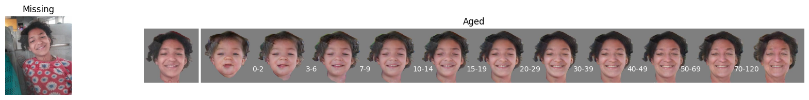

# Proof of Concept Pipeline for Face Aging

## Table of Contents
* [1. Face Detecting and Cropping](#faceCropping)
* [2. Enhance Faces](#enhanceFaces)
* [3. Align Faces](#alignFaces)
* [4. Face Aging](#faceAging)
* [Example Pipeline Runs](#pipelineRun)

## 1. Detect and Crop Faces  

## 2. Enhance Faces 

*Note: Enhancing images can make images bigger*

## 3. Align Faces 

## 4. Face Aging 

## Example Pipeline Runs 

*Note: Some of these examples were not enhanced/aligned, due to GPU memory issues. This problem was fixed in the project deployment notebook.*