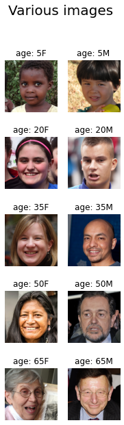
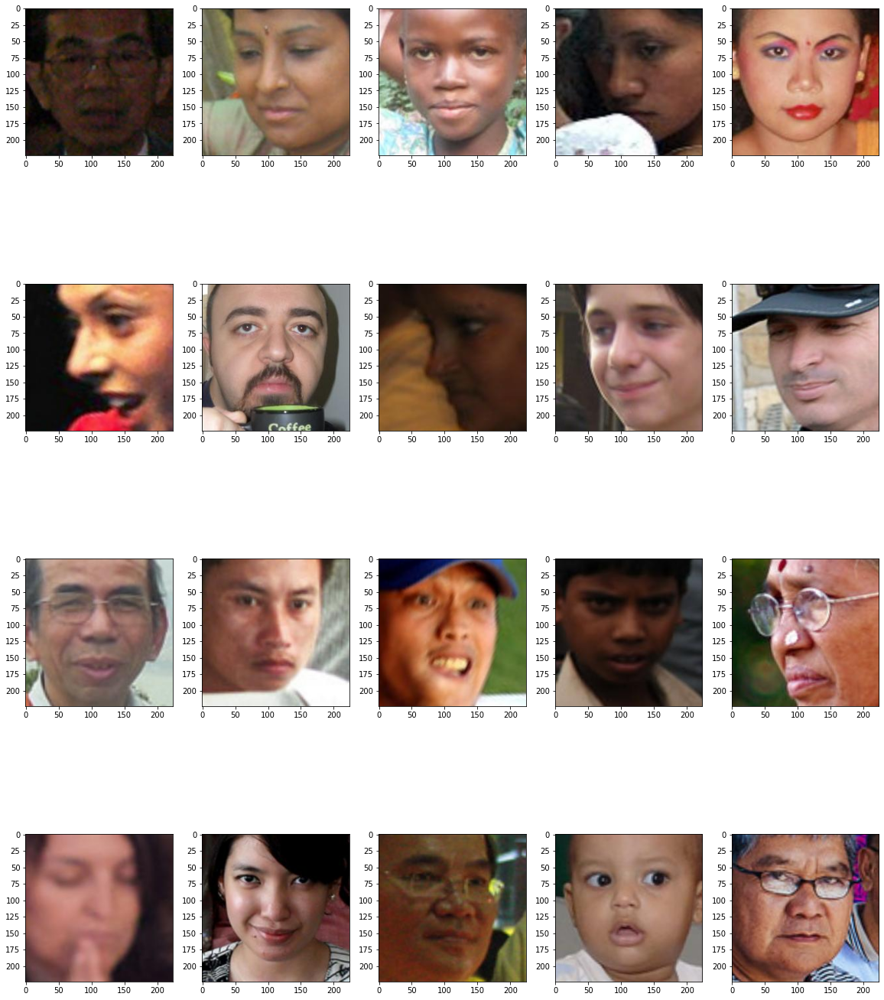
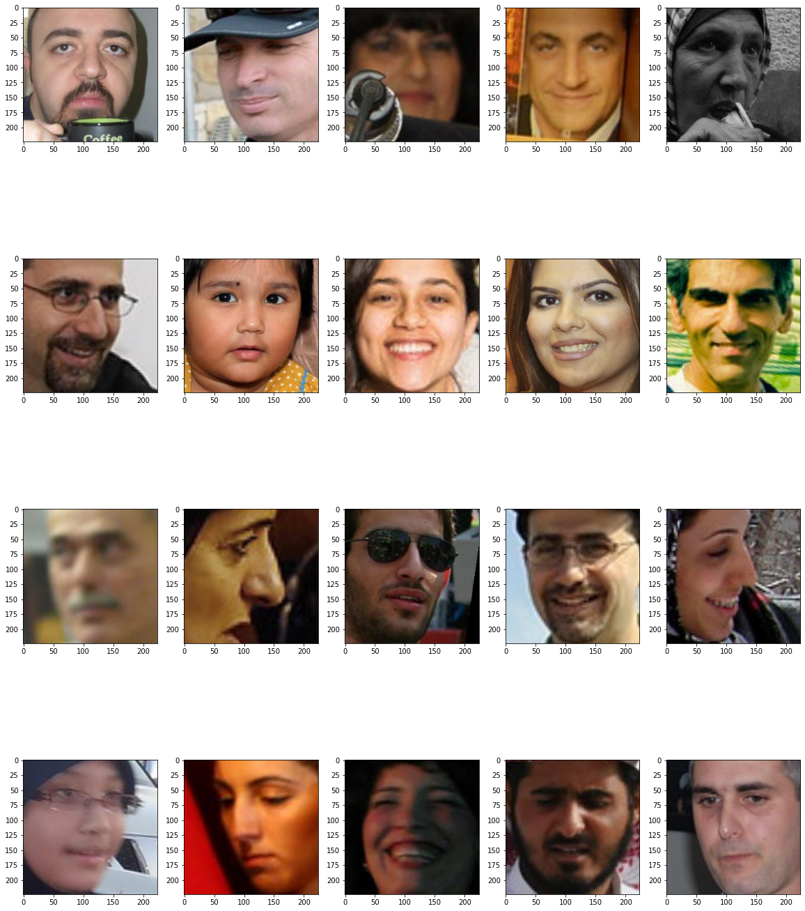
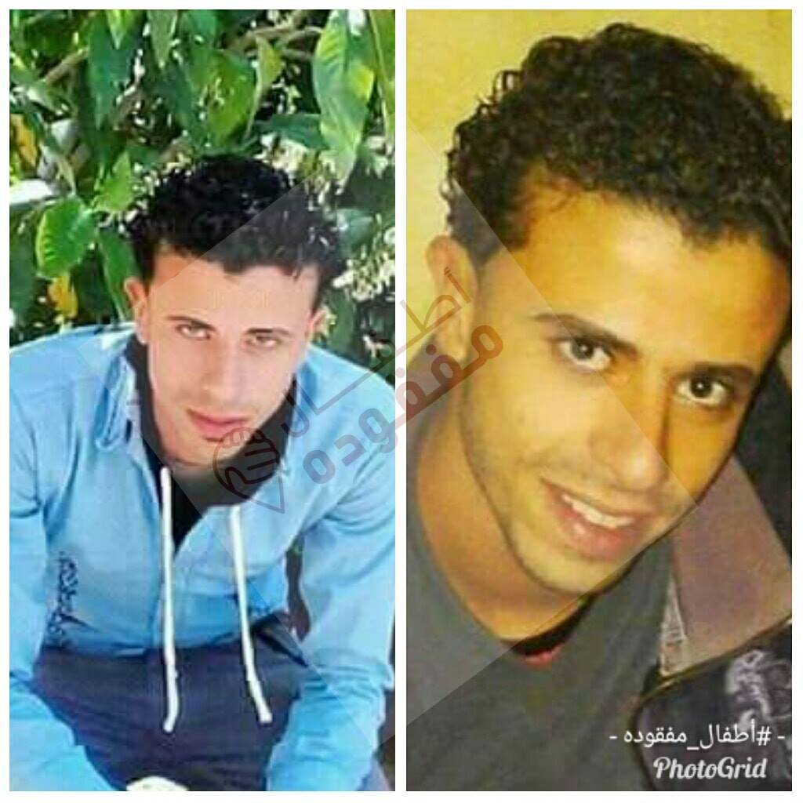
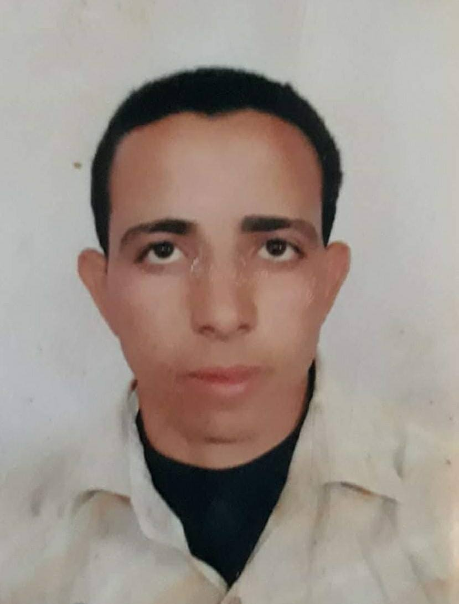

## How to Download Data

There are three datasets that we considered:
- Three datasets from online: *FFHQ, Adience, FairFace*
- One unlabeled dataset from client (of missing/found children and people)

To download FFHQ:  
- `!git clone https://github.com/DCGM/ffhq-features-dataset.git`

To download FairFace:  
- It is available on [HuggingFace](https://huggingface.co/datasets/HuggingFaceM4/FairFace).

To access the dataset of missing children:  
- Please contact Youssef and/or Rami.

We did not end up using the Adience dataset. If interested, it is publicly available online.

## Sample Images

### FFHQ

Various images and associated ages/genders:

### FairFace

Sample images from FairFace:

Sample images from FairFace, Middle Eastern focused:

### Atfal Mafkoda Images:

Sample images of missing people from Atfal Mafkoda:

Extra images can be found on [Atfal Mafkoda's website](https://atfalmafkoda.com/).