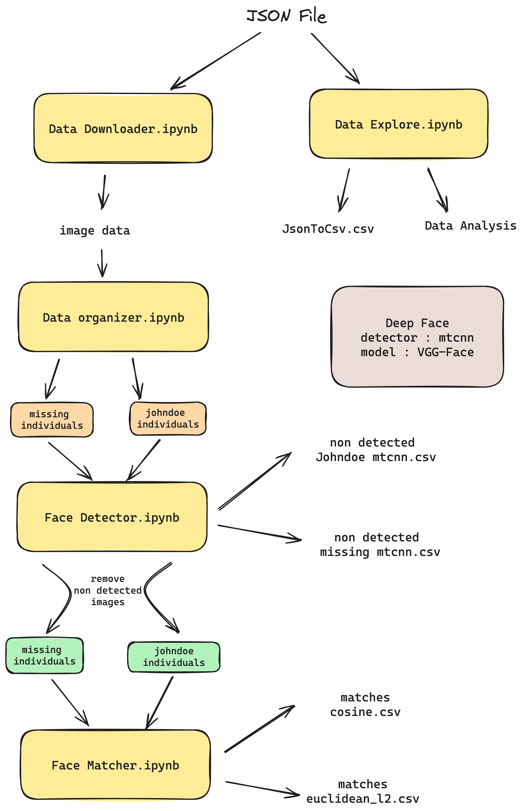

# Flow Documentation
This document provides an overview of the key components in our ML Pipeline. Please refer to each file for in depth explanation.

## Key Components

**JSON Data File**
- Description : This is a JSON file that contains all relevant Facebook data. It serves as the primary dataset.

**Data Downloader**
- Function : Downloads all images associated with a specific `CaseId`.
- Output : Images are stored in a structured directory named `case_status/case_id`.

**Data Organizer**
- Function : Aggregates enhanced images from each `CaseId`.
- Organization Method : Images are sorted into folders based on their `case_status`.

**Face Detector**
- Function : Identifies any faces that are not detectable and Removes non-detectable faces from the processing queue.
- Output : Non-detectable faces are listed in a CSV file.

**Face Matcher**
- Function : Compares each individual's face against a directory of 'John Does'.
- Output : Generates a CSV file listing individuals who resemble 'John Does' along with their respective similarity scores.




## data_downloader.ipynb

This notebook automates the downloading and organizing of images based on JSON Facebook posts data. Key features include:
- **Downloading Images**: It downloads images from URLs found in a JSON file and saves them in specified directories.
- **Organizing Data**: Images are organized by case status and IDs into separate folders.
- **Error Logging**: Missing data from the JSON file is logged into a CSV file for review.


## data_explore.ipynb 
 
The `data_explore` directory includes the `data_explore.ipynb` notebook, which specializes in analyzing and visualizing the given Facebook posts data. Key components and outputs of the notebook are outlined below:

### Data Conversion and Preprocessing
- The notebook begins by converting data from a JSON file to a CSV format using the `JsonToCsv` class, facilitating easier data manipulation and analysis with pandas.
- Essential preprocessing steps include cleaning text data and extracting relevant information like case IDs, case status, and other pertinent details.

### Data Analysis and Visualization
- **Case Status Analysis**: The notebook groups data by case status and counts unique case IDs. A bar graph is then generated to visualize the distribution of cases across different statuses, such as 'Missing', 'Reunited', and 'John Doe'.
- **Age Extraction and Analysis**: It includes a function to extract age from text data, particularly focusing on Arabic text. The notebook then analyzes the age distribution for different case statuses, providing insights into the age profiles of missing or unidentified individuals. Line graphs are plotted to show age frequencies, highlighting mean, median, and mode ages.

### Enhanced Image Analysis
- The code navigates through a structured directory containing image data, counting the number of enhanced images in specific subfolders. This part of the notebook is crucial for understanding the volume and distribution of enhanced images across different case IDs and post indexes.
- For each post index and case status, bar graphs are generated to display the frequency of case IDs with varying numbers of enhanced images. These visualizations are instrumental in identifying patterns or anomalies in the image enhancement process associated with the cases.


## data_organizer.ipynb

- **Input Directory**: Accepts the directory containing image data obtained after downloading using `data_downloader.ipynb`, along with the specified output directory for organized images.
- **Selective Extraction**: The script processes only specified folders within each image set, such as 'enhanced' images, based on user input.

### Output Structure  
- **Root Directory**: The output is stored in a specified folder.
- **Organized Directory Structure**: Within this root directory, the images are systematically categorized:
  - **Case Status Subdirectories**: Images are sorted into subdirectories named after each case status, such as 'Missing' and 'John Doe'.
  - **Image Type Folders**: Within each case status folder, images are further organized into folders based on their type (e.g., 'enhanced').
  - **Image Files**: These folders contain the relevant images, which are consistently named and sorted, facilitating easy location and access to specific images or sets of images.

This organized structure greatly simplifies the management and access of image categories, streamlining the process for further analysis or use in subsequent pipeline steps, such as `face_detector.ipynb`.


## face_detector_results

This directory contains outcomes from the `face_detector.ipynb` notebook, which focuses on facial detection—a crucial step before proceeding to `face_matching.ipynb`. 
Key elements and functionalities :

### `FaceDetector` Class Overview
-  Implements face detection on a set of images using the `DeepFace` library, capable of handling images where no faces are detected.
  
### Processing Workflow
- **Backend Selection**: Enables the selection of detection algorithms such as 'opencv', 'mtcnn','ssd', 'dlib', 'retinaface', 'mediapipe', 'yolov8', 'yunet','fastmtcnn’.
- **Face Detection Execution**: Processes images iteratively for face detection, using algorithms specified by the user.
- **Handling Non-Detected Images**: Depending on user preferences, images without detected faces are either deleted or moved to a designated folder.
- **Output Creation**: Produces a CSV file that details the filenames of images where faces were not detected, facilitating further analysis.
- **Graphical Representation**: Exhibits a bar chart to visually compare the count of non-detectable images across combinations like 'johndoe-mtcnn' and 'missing-opencv'.

-`non_detect_johndoe_mtcnn.csv` and  `non_detect_missing_mtcnn.csv` : CSV files with the filenames of images where faces were not detected when used mtcnn detector backend. 

- `non_detect_johndoe_opencv.csv` and `non_detect_missing_opencv.csv`: CSV files with the filenames of images where faces were not detected when used opencv detector backend. 

- `non_detected_faces_missing` and `non_detected_faces_johndoe`: Contain images from the 'missing' and 'John Doe' categories where faces were not detected using mtcnn.

-  We discovered that using MTCNN drastically reduced the number of non-detectable images, leading us to continue utilizing MTCNN in our pipeline, as it proved to be more effective compared to OpenCV.


## inputs_outputs

This directory contains essential files used in and generated by the project's notebooks. This includes a JSON file(response_1699422658272.json) with Facebook posts data, which serves as input for `data_downloader.ipynb`, the `jsontocsv.csv` file generated by `data_explore.ipynb`, and two output CSV files – `matches_cosine.csv` and `matches_euclideanl2.csv` – produced using various metrics in `face_matching.ipynb`.

### Summary of `face_matching.ipynb`
The `face_matching.ipynb` notebook plays a vital role in performing facial matching between two sets of images, utilizing a range of face recognition models and metrics. Its key features are as follows:

#### `FaceRecognition` Class
- **Purpose**: Matches faces between two datasets – one containing images of missing persons and another of unidentified individuals (John Doe).
- **Functionality**: Employs the `DeepFace` library for advanced face recognition, leading to the creation of detailed CSV files with match results.
-  In our pipeline, the MTCNN detector backend is used for face detection, and the VGG-Face model is employed for face recognition.

#### Key Functionalities
- **Model Selection**: Supports various face recognition models, including "VGG-Face", "Facenet", "Facenet512", "OpenFace", "DeepFace", "DeepID", "ArcFace", "Dlib", and "SFace".
- **Metric Options**: Provides the choice of multiple metrics for comparison, such as "cosine", "euclidean", and "euclidean_l2".
- **Face Matching Process**: Processes images iteratively from specified directories, applying face detection and matching techniques. The process can be customized using the different metrics and models.
- **Output Generation**: Generates CSV files listing the matches found, potentially identifying unknown individuals based on the selected model and metric.
- **Additional Output**: A pickle file representing image embeddings is also generated, enhancing the data analysis capabilities.

These features make the `face_matching.ipynb` notebook a comprehensive tool for facial recognition tasks, offering versatility and precision in identifying unknown individuals in various scenarios.

**Note on CSV File Structure**

- **`missing_filename` Column**: This column contains the filenames of the images for which matches are being sought. These images typically represent missing individuals or subjects of interest.

- **`unknowns_matched_filenames` Column**: This column lists the filenames from the pool of resulted matches from specific interest like johndoe individuals. These are the images identified as potential matches for the filenames listed in the `missing_filename` column.


## deployment
This directory includes all the Streamlit deployment files.


## experiment_results_analysis

This directory contains all the essential files and notebooks related to the results and analysis of the experiment. Below is an overview of each file:

- **exp_result_analysis_cosine.ipynb** and **exp_result_analysis_euclidean_l2.ipynb**: Jupyter notebooks dedicated to analyzing the face matching results obtained with the Cosine and Euclidean L2 metrics, respectively. They also include data processing, visualization, and statistical analysis tailored to each specific metric.

- **exp_matches_cosine.csv** and **exp_matches_euclideanl2.csv**: These files consist of all face matches calculated in `face_matching.ipynb` using the Cosine and Euclidean L2 metrics, respectively. They provide foundational datasets for understanding the nuances of facial recognition using these metrics.

- **aggregated_data_cosine.csv** and **aggregated_data_euclideanl2.csv**: Generated by `exp_result_analysis_cosine.ipynb` and `exp_result_analysis_euclidean_l2.ipynb` respectively, these files result from the data aggregation process.

**Note on `exp_result_analysis_cosine.ipynb` and `exp_result_analysis_euclidean_l2.ipynb` files**

- The term ‘Relevant matches’ refers to the faces that are correctly matched in the notebooks `exp_result_analysis_cosine.ipynb` and `exp_result_analysis_euclidean_l2.ipynb`. These matches are considered accurate or 'relevant' based on the specific metrics (Cosine or Euclidean L2) used in these notebooks.


## Experiment Overview

### Case Selection
The experiment begins by selecting case IDs that have at least two images of missing individuals. This ensures a sufficient dataset for effective comparison and analysis.

### Face Detection and Matching
-  Images are initially processed through `face_detector.ipynb`, employing the MTCNN algorithm for face detection.
-  Detected faces are matched using `face_matching.ipynb`. This notebook uses DeepFace with 'VGG-Face' as the model for recognition and 'mtcnn' as the detector backend. Matching is performed using two metrics: Euclidean L2 and Cosine.

### Generation of Match Results
The matching process yields two CSV files: `exp_matches_euclideanl2.csv` and `exp_matches_cosine.csv`. These files document the details of matched faces based on the respective metrics.
These CSV files were sent into 'exp_result_analysis_euclidean_l2.ipynb' and'exp_result_analysis_cosine.ipynb' files for further analysis.

## Data Analysis Process

### Preprocessing Stage
- **Removing Self-Matches**: Self-matches are identified and eliminated from the match results. This is crucial since matching missing individuals' images against their own set often results in identical matches, skewing the analysis.
- **Eliminating Duplicates**: The dataset is further cleaned by removing duplicate entries, ensuring uniqueness and validity of each data point.
- **Extracting Key Information**: Essential information like case IDs is extracted, which is crucial for individual case tracking and analysis.

### Aggregation and Data Refinement
- **Grouping by Case ID**: The data is organized by case IDs, collating all relevant information for each case. This facilitates more focused analysis on a case-by-case basis.
- **Resulting Data Files**: The aggregation process results in two key files: `aggregated_data_cosine.csv` and `aggregated_data_euclideanl2.csv`.

### Analysis of Match Counts
- **Counting Correct Matches**: The analysis includes counting the number of correct matches for each case ID from the pool of matches obtained through the face matching process.
- **Frequency and Distribution Insights**: The match counts are analyzed to understand the frequency of matches per case and their distribution across the dataset.
- **Precision of Matches**: This part of the analysis evaluates the precision of matches by examining score ranges and the position of the first match in the top results, crucial for assessing the accuracy of early matches.

## Result Analysis via Notebooks
Two notebooks, exp_result_analysis_euclidean_l2.ipynb and exp_result_analysis_cosine.ipynb, are utilized to analyze the results based on the Euclidean_L2 and Cosine metrics, respectively. While they follow parallel methodologies, each notebook specifically focuses on a distinct metric.

## Euclidean l2 Vs Cosine

| Criteria | Euclidean_l2 | Cosine |
|---|---|---|
| Total Case IDs Evaluated | 249 | 249 |
| Case IDs with No Matches | 26 | 18 |
| Case IDs with At Least One Match | 223 | 231 |
| Avg Pool Size | Small (221) | Large (336) |
| Probability of Finding Exact Match | Good | Slightly Higher |
| Matches in Top 50 Pool | 85.7% (191/223) | 86.6% (200/231) |


# Install required packages:
- Create a virtual environment and pip install the following modules
```
pip install requests  
pip install Pillow  
pip install tqdm 
pip install pandas 
pip install seaborn  
pip install matplotlib  
pip install deepface
```
