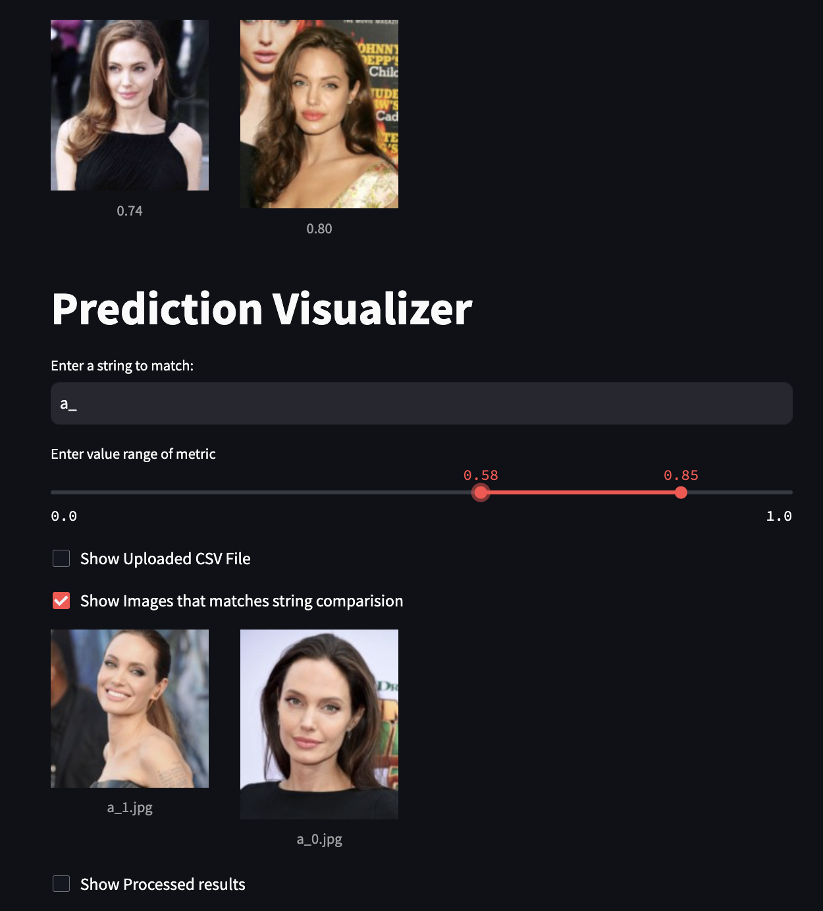

# Deployment Setup and Operation Guide
## Setting Up

Setting up the deployment is straightforward. Simply install the necessary packages using the pip install command with the provided [requirements.txt](requirements.txt) file.

## Working

1. **Upload CSV File**: Start by uploading a CSV result file, which is the output of your pipeline.
2. **Provide CaseId**: Enter a specific `caseId` in the user input section.
3. **Visualize Images**: Click the checkbox labeled "Show Images that matches string comparison" to view images associated with the provided caseId.
4. **Adjust Threshold Range**: Modify the threshold range according to the chosen metric. Images within the specified range of the distance metric will be displayed.

